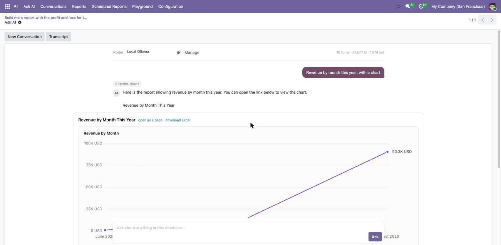
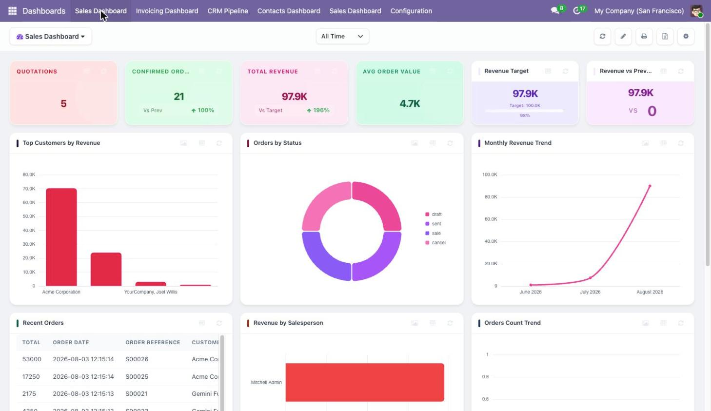

# May17 — Odoo apps

Documentation, screenshots and FAQ for the **May17** apps for Odoo: paid modules published on the
Odoo Apps Store by [Thinh Nguyen Huu](https://apps.odoo.com/apps/modules/browse?author=Thinh%20Nguyen%20Huu).

This repository holds the documentation only. The modules themselves are commercial (OPL-1) and are
sold on the Odoo Apps Store.

---

## The apps

### [AI Assistant and Reports](docs/ai-assistant-and-reports.md) — $249

**AI Assistant and Reports is a paid Odoo 19 module (Community and Enterprise) that adds an AI
assistant you can ask questions in plain English, and that answers with live reports, charts,
financial statements and Excel downloads.** It connects to a self-hosted Ollama server, or to
Anthropic Claude, OpenAI, Google Gemini, Azure OpenAI, or any OpenAI-compatible endpoint.

It ships 20 built-in tools and five financial statements — Profit and Loss, Balance Sheet, Trial
Balance, Aged Receivable and Aged Payable — computed from journal entries, so Odoo Community gets
them without an Enterprise subscription. Pointed at a local Ollama server it needs no API key and
sends nothing outside your network.

📖 [Documentation](docs/ai-assistant-and-reports.md) · 🛒 [Odoo Apps Store](https://apps.odoo.com/apps/modules/19.0/ai_assistant_reports)

---

### [Mobile App API and Sync](docs/mobile-api.md) — $149

**Mobile App API and Sync is a paid Odoo 19 module (Community and Enterprise) that turns an Odoo
database into a backend a mobile app can talk to**: a versioned REST API, one revocable token per
device, offline synchronisation and push notification delivery.

Odoo has JSON-RPC and API keys, but an API key is global and equal to the password over XML-RPC,
nothing tells one phone from another, and nothing answers "what changed since I was last online".
This supplies those. You build the app; this is the way in.

📖 [API reference](docs/mobile-api.md) · 🛒 [Odoo Apps Store](https://apps.odoo.com/apps/modules/19.0/mobile_api)

---

### [May17 Dashboard](docs/may17-dashboard.md) — $49

**May17 Dashboard is a paid Odoo 19 module (Community and Enterprise) that lets any user build
interactive dashboards from any Odoo model without writing code**, using 17 item types, 10
one-click templates and a live preview that renders the finished chart while you configure it.

It depends on three modules only — `base`, `web` and `sale` — so it installs on any database.

📖 [Documentation](docs/may17-dashboard.md) · 🔧 [Deployment guide](docs/may17-dashboard-deployment.md) · 🛒 [Odoo Apps Store](https://apps.odoo.com/apps/modules/19.0/may17_dashboard)

---

### [List Quick Filter](docs/list-quick-filter.md) — $40

**List Quick Filter is a paid Odoo 19 module that adds a configurable filter bar directly above any
list view**, so users filter records by several columns at once without opening the advanced search
panel. It supports 8 operators, many2one and many2many autocomplete tags, selection and boolean
dropdowns, and date pickers — configured per action, so each menu can carry its own filters.

📖 [Documentation](docs/list-quick-filter.md) · 🛒 [Odoo Apps Store](https://apps.odoo.com/apps/modules/19.0/list_quick_filter)

---

### [Month and Year Picker](docs/month-and-year-picker.md) — $9

**Month and Year Picker is a paid Odoo 19 module that adds four field widgets showing only the month
or only the year on date and datetime fields**, hiding the day entirely. A billing period reads
"March 2026" instead of "04/03/2026". It is a frontend-only module: two source files, no Python
model, no database change.

📖 [Documentation](docs/month-and-year-picker.md) · 🛒 [Odoo Apps Store](https://apps.odoo.com/apps/modules/19.0/may17_month_picker)

---

## Guides

- [How to get a Profit and Loss statement in Odoo 19 Community](articles/profit-and-loss-odoo-19-community.md)
- [Best Odoo 19 dashboard modules compared (2026)](articles/best-odoo-dashboard-modules-compared.md)
- [How to build a KPI dashboard in Odoo 19 without a developer](articles/how-to-build-a-kpi-dashboard-in-odoo-19.md)

## Frequently asked questions

### Are these modules free?

No. All five are paid modules sold on the Odoo Apps Store under the OPL-1 licence, at $249, $149, $49, $40 and $9. This repository contains their documentation, not their source code.

### Which Odoo versions are supported?

Odoo 19, Community and Enterprise. Every module is tested on both editions and modifies no Odoo core
file, so upgrades stay safe.

### Do the modules require any Python package?

No. Nothing beyond what Odoo itself already installs. May17 Dashboard bundles its chart library
inside the module, and AI Assistant and Reports reaches AI providers over plain HTTP rather than
through a vendor SDK — so both work on a server with no internet access, the AI one paired with a
local Ollama server.

### Where do I get support?

Email **huuthinh17596@gmail.com** — answered within 48 hours by the author. Bug fixes are included
for the purchased Odoo series.

### Can I try before buying?

The Odoo Apps Store page for each module carries screenshots and the full feature list. For a live
walkthrough, email the address above.

---

*Odoo AI assistant · Odoo 19 AI · Odoo AI report generator · Odoo Ollama · Odoo local LLM ·
Odoo profit and loss Community · Odoo 19 dashboard · Odoo KPI dashboard · Odoo list view filter ·
Odoo month picker widget · no-code dashboard for Odoo · Odoo apps by May17*
