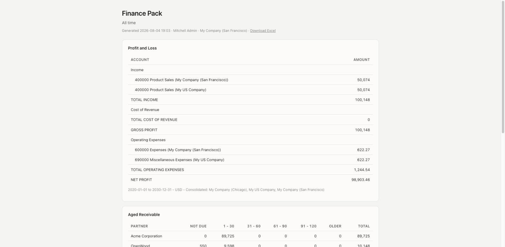
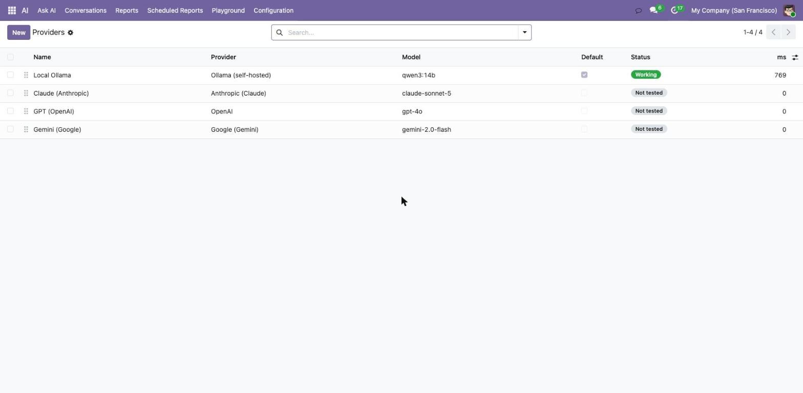
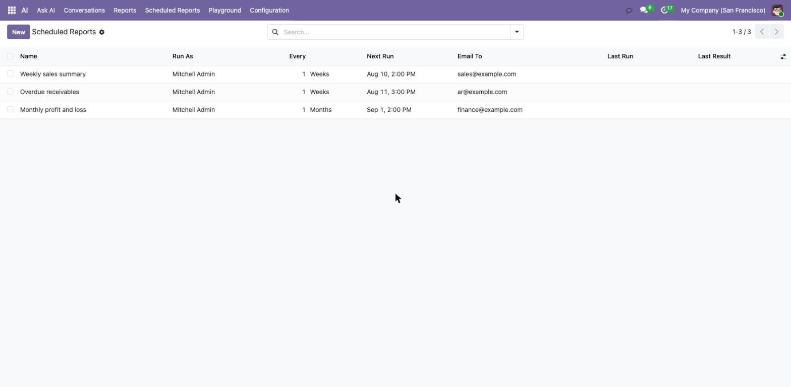

# AI Assistant and Reports — ask Odoo 19 a question, get a live report

**AI Assistant and Reports is a paid Odoo 19 module (Community and Enterprise) that adds an AI
assistant you can ask questions in plain English, and that answers with live reports, charts,
financial statements and Excel downloads.** It connects to a self-hosted Ollama server, or to
Anthropic Claude, OpenAI, Google Gemini, Azure OpenAI, or any OpenAI-compatible endpoint.

🛒 **[Get it on the Odoo Apps Store](https://apps.odoo.com/apps/modules/19.0/ai_assistant_reports)** — $249, one-time.

## What it does

Ask *"revenue by month this year, with a chart"* and you get a chart, not a paragraph. Ask
*"who owes us the most?"* and you get an aged receivable per customer. Ask *"how did we do last
quarter?"* and you get a Profit and Loss built from your journal entries. Every answer can be opened
as a page, downloaded as a spreadsheet, or scheduled to arrive every Monday morning.

| | |
|---|---|
| **Built-in tools** | 20 — search, count, group, model introspection, reports, agenda, create/update/delete |
| **Financial statements** | 5 — Profit and Loss, Balance Sheet, Trial Balance, Aged Receivable, Aged Payable |
| **Chart types** | 6 — bar, horizontal bar, line, area, pie, doughnut — rendered as SVG on the server |
| **AI providers** | 6 — Ollama, Anthropic Claude, OpenAI, Google Gemini, Azure OpenAI, any OpenAI-compatible endpoint |
| **Report section types** | 5 — KPI tiles, charts, tables, financial statements, your own commentary |
| **Python packages to install** | 0 |
| **Dependencies** | 2 — `base`, `web` |
| **Odoo core files modified** | 0 |

## Financial statements on Odoo Community

Odoo's own Profit and Loss and Balance Sheet ship in `account_reports`, which is Enterprise-only. On
Community the `account.report` model exists but carries no engine, so there is nothing to call.

This module computes all five statements directly from `account.move.line`, which every edition has.
Community users get Profit and Loss, Balance Sheet, Trial Balance, Aged Receivable and Aged Payable
without an Enterprise subscription. Aged reports bucket each partner into six ageing bands — not due,
1–30, 31–60, 61–90, 91–120 and older. Multi-company statements state which companies they consolidate,
so a figure is never presented as one company's when it is three companies added together.

## It can run entirely on your own machine

Point the module at a local Ollama server and no question, no customer name and no figure ever
leaves your network. There is no API key to buy, no per-token bill and no cloud vendor in the loop.

If you would rather use a hosted model, the same module talks to Claude, GPT, Gemini or Azure OpenAI
with your own key — requests go directly from your Odoo server to the provider you chose, and
nowhere else. The OpenAI-compatible option also reaches OpenRouter, Groq, Together, DeepSeek,
LM Studio and vLLM by setting the endpoint URL.

## Key features

- Ask questions in plain English — the assistant picks the model, the filter and the grouping itself
- Reports drawn in the page, under the answer: no link to copy, no file to open first
- Excel export on every report: one sheet per section, numbers written as numbers so they can be
  summed, frozen headers, auto-filters, and native Excel charts rather than a picture of a chart
- Scheduled reports — a weekly sales summary or a monthly P&L that builds and emails itself
- Reports stay live: a report is stored as a specification, not frozen HTML, so re-opening it next
  month re-runs the queries against today's data
- Every write is confirmed by a human before it happens; deletions are barred from scheduled runs
- Tool registry an administrator can extend from the interface, without writing Python
- Full audit trail: every tool call logged with arguments, result, status and duration
- No Odoo core modification — safe for upgrades

## Security

The assistant never gets rights of its own. Every query runs as the person asking, so access rights,
record rules and multi-company scoping apply exactly as they do everywhere else in Odoo. This holds
for shared report links too: two people opening the same link each see their own figures, and a user
without accounting access gets an access error instead of a Profit and Loss.

Write tools are held back and the exact values shown for approval first; nothing is written until
someone accepts. One call may not touch more than 50 records, and fields that grant access rather
than store data — passwords, group membership, access tokens — cannot be written at all.

The assistant never writes SQL and never writes HTML. It emits a typed specification which the
module validates and renders, so nothing it produces is interpreted as markup or as a query. Report
pages are served with a strict Content-Security-Policy and a per-report access token.

## Frequently asked questions

### Does it work on Odoo 19 Community?

Yes. AI Assistant and Reports works on Odoo 19 Community and Enterprise, on Odoo Online, Odoo.sh and
on-premise. The financial statements are computed from journal entries, so they work on Community,
where Odoo's own accounting reports are not available.

### Do I need an API key or a subscription?

Not if you use Ollama. A local Ollama server needs no key and costs nothing per question. If you
prefer Claude, GPT, Gemini or Azure OpenAI, you use your own key and are billed by that provider
directly — there is no markup and no middleman.

### Can the AI change or delete my data?

Only if a person approves it. Write tools are held back and the exact values are shown for approval
first. Deletions are additionally blocked from unattended scheduled runs, and one call may not touch
more than 50 records.

### Can it see data the user is not allowed to see?

No. Every query runs as the person asking, so access rights, record rules and multi-company scoping
apply unchanged — including through a shared report link.

### Do I have to install Python packages?

No. Providers are reached over plain HTTP, so there is no vendor SDK to install. The module installs
on a clean Odoo 19 database as it is, which also means it works on Odoo Online.

### Which model should I use?

A larger model writes better prose and picks tools more reliably. Small local models answer
correctly but phrase things awkwardly; that is a property of the model, not of the module, and
switching provider takes one dropdown.

### How is this different from Odoo 19's own AI?

Odoo 19's AI agents, AI fields and AI server actions are Enterprise-only and connect to ChatGPT or
Gemini in the cloud. This module runs on Community as well, can run entirely on a local Ollama
server, and is built around producing reports rather than filling in fields.

### What are the limits?

The financial statements need the Accounting app installed; everything else works without it. The
assistant does not read PDFs or images yet, and does not import data from outside Odoo.

### Is support included?

Yes. Bug fixes for the purchased Odoo series, questions answered within 48 hours by the author:
**huuthinh17596@gmail.com**

---

*Odoo AI assistant · Odoo 19 AI · Odoo AI report generator · Odoo ChatGPT integration ·
Odoo Claude integration · Odoo Ollama · Odoo local LLM · Odoo profit and loss Community ·
Odoo aged receivable · Odoo report to Excel · Odoo scheduled report*
