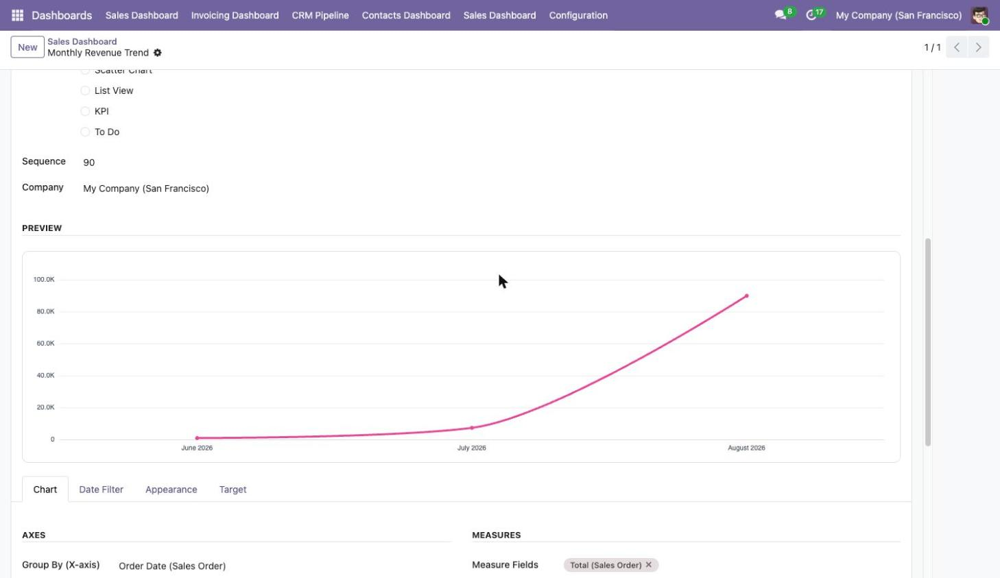
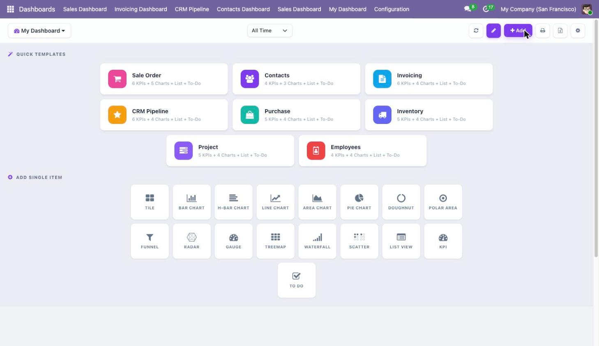

# May17 Dashboard — KPI & chart dashboard builder for Odoo 19

**May17 Dashboard is a paid Odoo 19 module (Community and Enterprise) that lets any user build
interactive dashboards from any Odoo model without writing code**, using 17 item types, 10
one-click templates and a live preview that renders the finished chart while you configure it.

It depends on three modules only — `base`, `web` and `sale` — so it installs on any database,
including one with no CRM, no Inventory and no Manufacturing.

📦 **[Get it on the Odoo Apps Store](https://apps.odoo.com/apps/modules/19.0/may17_dashboard)**

---

## What it does

| | |
|---|---|
| **Item types** | 17 — tile, KPI, gauge, to-do, list view, and 13 chart types |
| **Chart types** | bar, horizontal bar, line, area, pie, doughnut, polar area, funnel, radar, gauge, treemap, waterfall, scatter |
| **Templates** | 10, one click each; hidden when their app is not installed |
| **Date filters** | 24 presets + a custom range |
| **Dependencies** | 3 — `base`, `web`, `sale` |
| **Odoo core files modified** | 0 |
| **Chart engine** | Apache ECharts 6.1.0, bundled in the module (no CDN) |
| **License** | OPL-1 |

## Why this one

- **Installs anywhere.** Three dependencies. Dashboard apps that pull in ten or more core apps
  change your app list before they even start.
- **See it before you save it.** Pick a chart type and the real chart, with your real data,
  renders inside the configuration form.
- **A full dashboard in one click.** 10 templates build 9 to 13 configured items each.
- **Export built in.** Any chart to PNG, any item or the whole dashboard to `.xlsx`, the whole
  dashboard to PDF through the browser — no server-side PDF engine required.
- **Runs offline.** The chart library ships inside the module, so no request leaves your server.

## Templates

| Template | Model | Items |
|---|---|---|
| Sale Order | `sale.order` | 13 |
| Invoicing | `account.move` | 12 |
| CRM Pipeline | `crm.lead` | 12 |
| Purchase | `purchase.order` | 11 |
| Inventory | `stock.picking` | 11 |
| Project | `project.task` | 11 |
| Manufacturing | `mrp.production` | 11 |
| Point of Sale | `pos.order` | 10 |
| Employees | `hr.employee` | 10 |
| Contacts | `res.partner` | 9 |

A template is only offered when its app is installed, so the picker always matches the database.

## Installation

1. Copy `may17_dashboard` into your Odoo addons path.
2. Restart Odoo and update the apps list.
3. Install **May17 Dashboard** from Apps.
4. Open **Dashboard → Dashboards → New**.

Requires Odoo 19 (Community or Enterprise). Python dependencies: none beyond Odoo's own.

## Frequently asked questions

### How is May17 Dashboard different from a free Odoo dashboard module?

Free dashboard modules are usually tied to one app or one fixed layout. May17 Dashboard builds
dashboards from any model in your database, ships 10 one-click templates, previews every chart
while you configure it, and adds only 3 dependencies.

### Will it install if I do not use CRM, Inventory or Manufacturing?

Yes. May17 Dashboard depends on `base`, `web` and `sale` only. Templates for apps you have not
installed are simply not offered.

### Do I need a developer to create a dashboard?

No. Every item is configured from a normal Odoo form view: pick a model, a measure, a group-by
and a domain. Writing Python or XML is never required.

### Which models can I build a dashboard from?

Any model in the database, including custom models created with Odoo Studio.

### Can I export a dashboard?

Yes. Any chart downloads as a PNG at twice screen resolution, any item or the whole dashboard
exports to `.xlsx` with one sheet per item, and the dashboard prints to PDF from the browser.

### Does it send my data anywhere?

No. Apache ECharts is bundled inside the module, so no request leaves your server. May17
Dashboard works on an air-gapped installation.

### Does the data refresh automatically?

Yes. Choose one of 7 auto-refresh intervals between 15 seconds and 10 minutes, per dashboard.

### How does it handle multi-company?

Each dashboard carries a company, record rules isolate data per company, and the `%MYCOMPANY`
domain variable resolves to the current company at render time. `%UID` filters records down to
the logged-in user.

## What it does not do (yet)

- No pivot, map, gantt or calendar item types — the 17 above are the full list.
- No scheduled dashboard email; export is on demand.
- No drill-down: clicking a chart opens the records, it does not re-group the chart.
- One item reads one model — no cross-model joins.

## Support

Bug fixes are included for the purchased Odoo series. Questions are answered within 48 hours by
the author: **huuthinh17596@gmail.com**

## Author

**Thinh Nguyen Huu** — Odoo modules for people who would rather not wait for a developer.
Other apps: [List Quick Filter](list-quick-filter.md),
[Month and Year Picker](month-and-year-picker.md).

---

*Odoo 19 dashboard · Odoo KPI dashboard · Odoo chart builder · Odoo BI dashboard · no-code
dashboard for Odoo · Odoo dashboard module with export*
